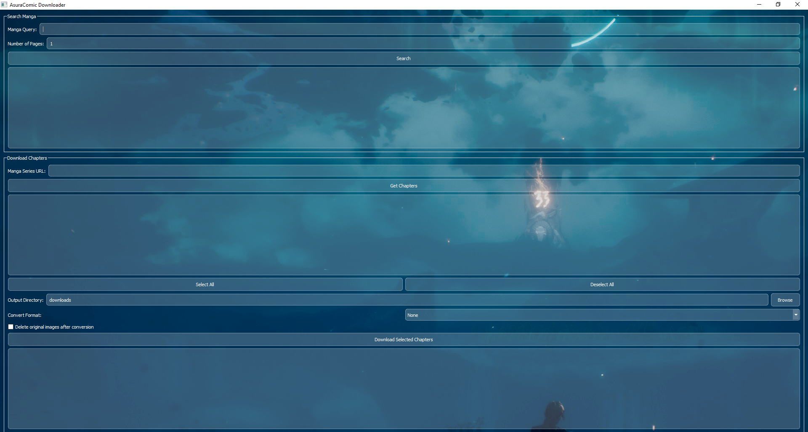

# AsuraComic Downloader


## Introduction

AsuraComic Downloader is a versatile tool designed to simplify the process of downloading manga from AsuraComic / AsuraScans. It offers both a powerful command-line interface (CLI) for automation and an intuitive graphical user interface (GUI) for ease of use, allowing users to search, browse, and download manga chapters efficiently.

## Features

### Command-Line Interface (CLI)

The CLI provides robust functionality for users who prefer script-based operations or integration into other tools.

*   **Search Manga:** Find manga by query with options to specify the number of search pages.
*   **Get Chapters:** List all available chapters for a given manga series URL.
*   **Download Single Chapter:** Download a specific chapter by its URL.
*   **Batch Download:** Download multiple chapters from a manga series in parallel, supporting ranges (e.g., '1-5'), specific lists (e.g., '1,3,5'), or all chapters.
*   **Format Conversion:** Convert downloaded images to PDF or CBZ formats.
*   **Automatic Deletion:** Option to delete original image folders after successful conversion.
*   **Interactive Mode:** A guided interactive wizard for searching, browsing, and downloading manga with real-time logs.

### Graphical User Interface (GUI)

The GUI offers a user-friendly experience with visual controls for all core functionalities.

*   **Intuitive Search:** Search for manga and view results in a clickable list. Clicking a result automatically populates the manga URL for download.
*   **Seamless Download Workflow:** Input a manga series URL, fetch and display available chapters, then select single or multiple chapters for download.
*   **Chapter Selection:** Easily select individual chapters, or use "Select All" / "Deselect All" buttons for convenience.
*   **Output Options:** Choose output directory and conversion format (PDF/CBZ).
*   **Transparent Design:** A modern, transparent glass-like aesthetic for buttons, input fields, and lists, including the format selection dropdown.

## Installation

To get started with AsuraComic Downloader, follow these steps carefully.

1.  **Clone the repository:**
    ```bash
    git clone https://github.com/Yui007/asuracomic_downloader.git
    cd asuracomic_downloader
    ```

2.  **Create a virtual environment (recommended):**
    ```bash
    python -m venv .venv

    # Windows
    .venv\Scripts\activate

    # Linux/Mac
    source .venv/bin/activate
    ```

3.  **Install dependencies:**
    ```bash
    pip install -r requirements.txt
    ```

4.  **Install Playwright browsers (important):**
    ```bash
    python -m playwright install
    ```

Note: Without this step, dynamic scraping will fail.

## Usage

### GUI Usage

To launch the graphical user interface:

```bash
python gui/main.py
```



From the GUI, you can:
1.  Use the "Search Manga" section to find series. Click on a search result to automatically populate the manga URL.
2.  In the "Download Chapters" section, enter a manga series URL and click "Get Chapters" to list all available chapters.
3.  Select the desired chapters from the list using the checkboxes, or use "Select All" / "Deselect All".
4.  Choose your output directory and desired conversion format.
5.  Click "Download Selected Chapters" to start the download process.

### CLI Usage

The CLI provides several commands for direct interaction.

Note: Asura domains frequently change between `.net`, `.com`, and other variants. Adjust the URL based on the current active site.

*   **Search for Manga:**
    ```bash
    python cli/main.py search "Manga Title" --pages 2
    ```

*   **Get Chapters for a Series:**
    ```bash
    python cli/main.py get-chapters "https://asuracomic.net/series/example-manga-url"
    ```

*   **Download a Single Chapter:**
    ```bash
    python cli/main.py download "https://asuracomic.net/series/example-manga-url/chapter/1" -o my_downloads --format pdf --delete
    ```

*   **Batch Download Chapters:**
    ```bash
    # Download a range of chapters (e.g., chapters 1 to 5)
    python cli/main.py batch-download "https://asuracomic.net/series/example-manga-url" --chapters "1-5"

    # Download specific chapters (e.g., chapters 1, 3, and 5)
    python cli/main.py batch-download "https://asuracomic.net/series/example-manga-url" --chapters "1,3,5"

    # Download all chapters
    python cli/main.py batch-download "https://asuracomic.net/series/example-manga-url" --all
    ```

*   **Interactive CLI Mode:**
    ```bash
    python cli/main.py interactive
    ```
    Follow the on-screen prompts to navigate through search, chapter selection, and download options.

For detailed CLI usage instructions and examples, please refer to the [CLI_usage.md](CLI_usage.md) file.

## Important Notes

*   **Dynamic Loading:** This tool uses Playwright (browser automation) instead of static scraping. This is required because AsuraScans loads content and images dynamically via JavaScript.
*   **Download Speeds:** Large batch downloads may take time depending on your system, internet speed, and current host server load.

## Technologies and Dependencies Used

| Package | Purpose | Recommended Version |
| --- | --- | --- |
| Python | Core programming language | 3.8+ |
| PyQt5 | GUI framework | >=5.15.0 |
| Typer | CLI framework | >=0.9.0 |
| Playwright | Dynamic scraping engine | >=1.40.0 |
| BeautifulSoup4 | HTML/XML parsing | >=4.12.0 |
| Pillow | Image processing and conversion | >=10.0.0 |
| Requests | HTTP fallback/requests | >=2.31.0 |
| Rich | CLI UI enhancement | >=13.7.0 |
| Colorlog | Colored logging in console | >=6.7.0 |
| Natsort | Natural sorting of chapters | >=8.4.0 |

## Contributing

Contributions are welcome. If you have suggestions for improvements, bug reports, or want to contribute code:

*   Open an issue for bugs or suggestions.
*   Submit a pull request on the [GitHub repository](https://github.com/Yui007/asuracomic_downloader).

## License

This project is licensed under the MIT License - see the [LICENSE](LICENSE) file for details.
