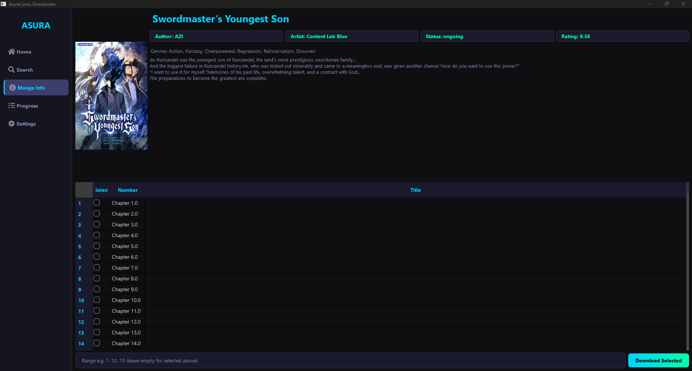

# ⚡ AsuraComic Downloader

[](https://opensource.org/licenses/MIT)
[](https://www.python.org/downloads/)

I got tired of the slow, manual process of downloading manga chapters for offline reading, so I built this. AsuraComic Downloader is a high-speed, dual-interface tool that handles the heavy lifting for you—whether you're a CLI power user or prefer a sleek, modern GUI.



## 🌟 Why use this?

Most downloaders are either too simple or overly complex. This one hits the sweet spot:
- **Concurrent Engine**: It doesn't just download one image at a time. It hammers the API with multiple threads to get your chapters finished in seconds.
- **UI**: Built with PyQt6.
- **Ready for Readers**: Generates `ComicInfo.xml` automatically so your library (Komga, Kavita, etc.) picks up all the metadata instantly.
- **Flexible Exports**: Choose between raw Images, a clean PDF, or a standard CBZ.

---

## 🔥 Features at a Glance

### 🖥️ The GUI Experience
- **Fluid Navigation**: Sidebar-based layout for switching between searching, info, and progress.
- **Visual Search**: Large, clear manga cards with cover art.
- **Smart Selection**: Select exactly which chapters you want from a clean table, or just type a range.
- **Live Monitoring**: Multiple progress bars so you know exactly what's happening under the hood.

### ⌨️ The CLI Power
- **Interactive Wizard**: Just run it and follow the prompts. No need to memorize complex flags.
- **Batch Processing**: Need chapters 1 to 50? Just type `1-50` and walk away.
- **Detailed Logging**: Powered by `Rich` for a beautiful, color-coded terminal experience.

---

## 🛠️ Getting Started

### Prerequisites
Make sure you have Python 3.8 or higher installed.

### Installation
1. Clone this repo:
   ```bash
   git clone https://github.com/Yui007/asuracomic_downloader.git
   cd asuracomic_downloader
   ```

2. Grab the dependencies:
   ```bash
   pip install -r requirements.txt
   ```

### Usage
- **For the GUI**: `python gui_main.py`
- **For the CLI**: `python main.py`

---

## ⚙️ Configuration
The first time you run it, a `config.json` will be created. You can tweak things like:
- `download_path`: Where the magic happens.
- `threads_chapters`: How many chapters to pull at once (default is 3).
- `threads_images`: How many images per chapter to pull at once (default is 10).

---

## 🤝 Contributing
Found a bug? Have a cool feature idea? Open an issue or a PR. I'm always looking to make this faster and better.

## 📄 License
This project is licensed under the MIT License. Check the `LICENSE` file for the full text.

---
*Built with passion for the manga community.*
